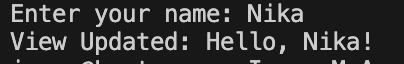

# Model-View-ViewModel

## MVVM 
Це шаблон архітектури програмного забезпечення, який розділяє програму на три незалежні компоненти: Model, View та ViewModel.

Його основна мета - відокремити логіку бізнес-даних від інтерфейсу користувача, зменшити залежності в коді та спростити тестування й розширення застосунку.

## Опис коду
### Model

UserModel зберігає просто ім'я.

### ViewModel

UserViewModel є посередником між View та Model. 

Він - приймає значення з View, записує його в Model, формує новий рядок Greeting, сповіщає View про зміну через INotifyPropertyChanged.

### View

UserView реагує на зміну властивостей у ViewModel.
Коли ViewModel генерує нове привітання - View автоматично оновлюється.

## Результат

### Як це працює разом:

1) Користувач вводить ім'я у View;

2) View записує це ім'я в ViewModel;

3) ViewModel оновлює Model і генерує нове Greeting;

4) ViewModel сповіщає View про зміну;

5) View відображає оновлений текст.

Це повністю відображає принципи MVVM: View не знає логіки, ViewModel не знає UI, Model лише тримає дані.
